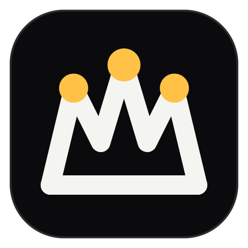
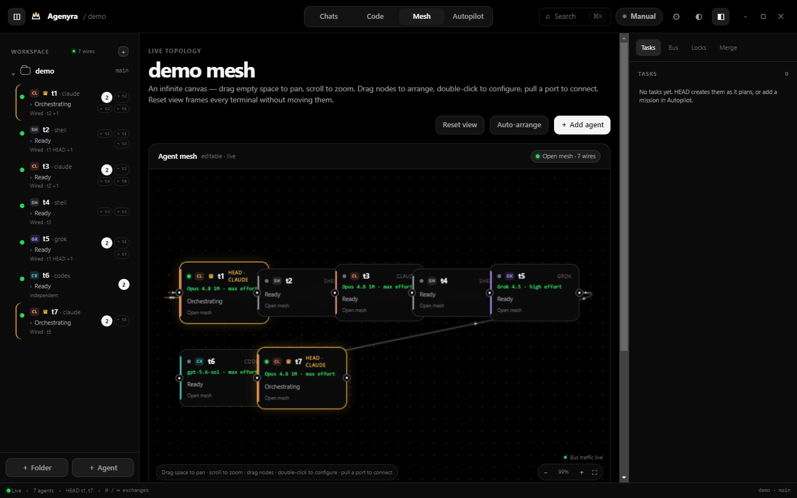
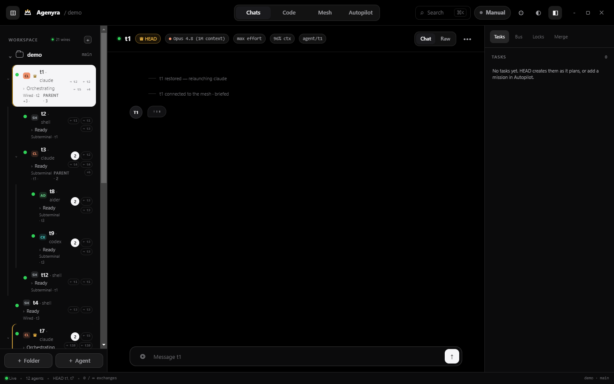

<p align="center">
  
</p>

<h1 align="center">Agenyra</h1>

<p align="center"><b>Your AI dev team, on one screen.</b><br>
Run many AI CLI agents in live terminals, wire them into a mesh, and let a HEAD agent orchestrate the work — 100% local.</p>

<p align="center">
  <a href="./LICENSE"></a>
  
  <a href="https://github.com/weigibbor/agenyra/releases"></a>
</p>



## Why Agenyra

- **A real AI team, not one chatbot.** Claude Code, Codex, Grok, Aider — or any CLI — run side by side as genuine PTY terminals. They message each other over a local bus, claim tasks from a shared board, and coordinate with locks, so parallel agents don't step on each other.
- **A HEAD that leads.** Promote any terminal to **HEAD** (crown it) and it plans, delegates to workers, reviews their diffs, and merges. Hierarchies go as deep as you need — parents, sub-parents, multiple HEADs across projects.
- **You see everything.** An infinite pan/zoom mesh canvas shows the live topology with bus traffic flowing over the wires. Flip any agent between a clean chat lens and its raw terminal. Watch code being edited live in the workbench.
- **Safe by construction.** Every worker codes inside its own git worktree — isolated branches, reviewed in-app, merged only when you (or a supervised HEAD) approve. Guardrails cap exchanges, detect loops, and enforce a spend budget.
- **Runs while you sleep.** Autopilot works through a mission queue with a watchdog, pauses at merge gates in supervised mode, and greets you with a digest of what happened overnight.
- **Local and private.** No cloud backend, no telemetry. The message bus binds to 127.0.0.1 and requires a per-session token, so nothing outside your machine can reach your agents.
- **Know what it costs.** Live token and spend estimates per agent, with a session budget cap that halts the mesh before your wallet notices.

## Install

Grab the latest from **[Releases](https://github.com/weigibbor/agenyra/releases)**:

| Platform | File | Note |
|---|---|---|
| Windows | `Agenyra Setup x.y.z.exe` | Unsigned test build — SmartScreen: *More info → Run anyway* |
| macOS (Apple Silicon) | `Agenyra-x.y.z-arm64.dmg` | Unsigned — right-click the app → *Open* |
| macOS (Intel) | `Agenyra-x.y.z.dmg` | Unsigned — right-click the app → *Open* |

Then add a project folder, spawn agents inside it, crown a HEAD, and hand it a goal.

## How agents talk — the `mesh` CLI

Every pane gets the `mesh` CLI on PATH, pre-authenticated to the local bus:

```sh
mesh send <pane> "<msg>"              # message another pane (wires permitting)
mesh announce "<msg>"                 # broadcast a heads-up
mesh task add|claim|done|review|list  # shared task board (atomic claims)
mesh step add|start|done "<label>"    # live checklist shown in the UI
mesh status "<activity>"              # current activity line
mesh at "<file/dir>"                  # where you are in the code
mesh lock acquire|release <resource>  # shared-resource mutex
mesh mission done|blocked             # HEAD reports the active mission
```

Strict mode routes messages only along wires you draw; **open mesh** lets every terminal in a folder talk freely while you prototype.

## The views

| View | What it's for |
|---|---|
| **Chats** | Chat lens per agent (or raw terminal), image paste, live context/cost chips |
| **Code** | Live workbench — watch agents edit, review changes, use the dock terminal |
| **Mesh** | The infinite canvas — arrange nodes, drag wires, configure roles and routes |
| **Autopilot** | Mission queue, guardrails, run timeline, morning digest |



## Develop

```sh
npm install     # Electron + xterm + node-pty
npm start       # launch the app
npm test        # smoke suite (bus, routing, security gate, CLI end-to-end)
```

More suites: `node test/guard.js` · `node test/worktree.js` · `node test/autopilot.js` · `node test/session.js`

## Build

```sh
npm run dist        # Windows NSIS installer → dist/
npm run dist:mac    # macOS dmg (run on macOS, or use the "Build macOS" GitHub Action)
```

## Structure

```
main.js              Electron main entry (window, IPC, boot)
preload.js           contextBridge API (renderer <-> main)
main/                bus, router, pty, coordinator, worktrees, autopilot, cost, sessions
renderer/            vanilla-JS UI (chats, code workbench, mesh canvas, autopilot)
bin/mesh(.js/.cmd)   the `mesh` CLI injected into every pane
test/                deterministic test suites
```

## Contributing

Agenyra is open source and contributions are welcome:

- 💬 **[Discussions](https://github.com/weigibbor/agenyra/discussions)** — suggest features, ask questions, share setups
- 🐛 **[Issues](https://github.com/weigibbor/agenyra/issues)** — report bugs
- 🔀 **Pull requests** — see [CONTRIBUTING.md](./CONTRIBUTING.md) for the quick guide (tests to run, style, security rules)

## License

[MIT](./LICENSE) — free to use, fork, and ship.
